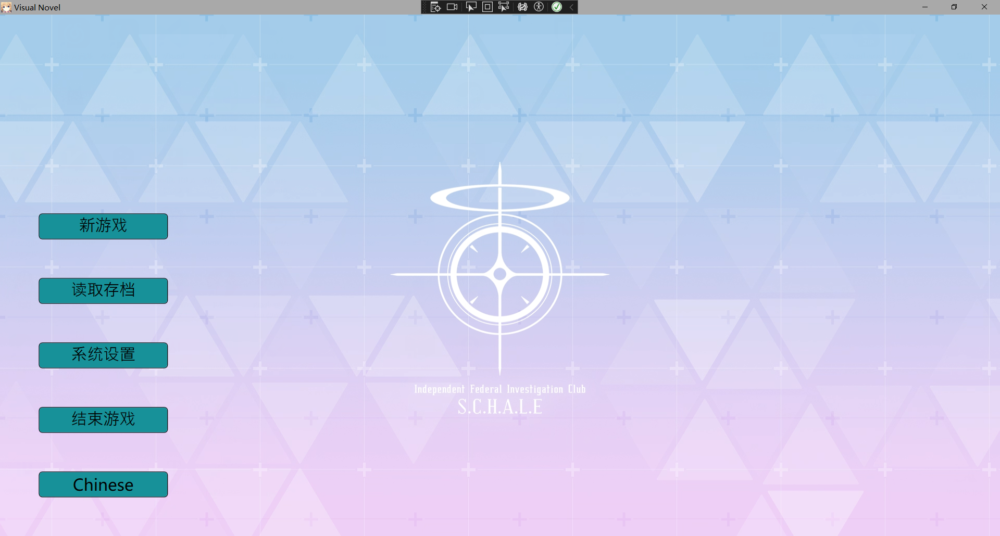
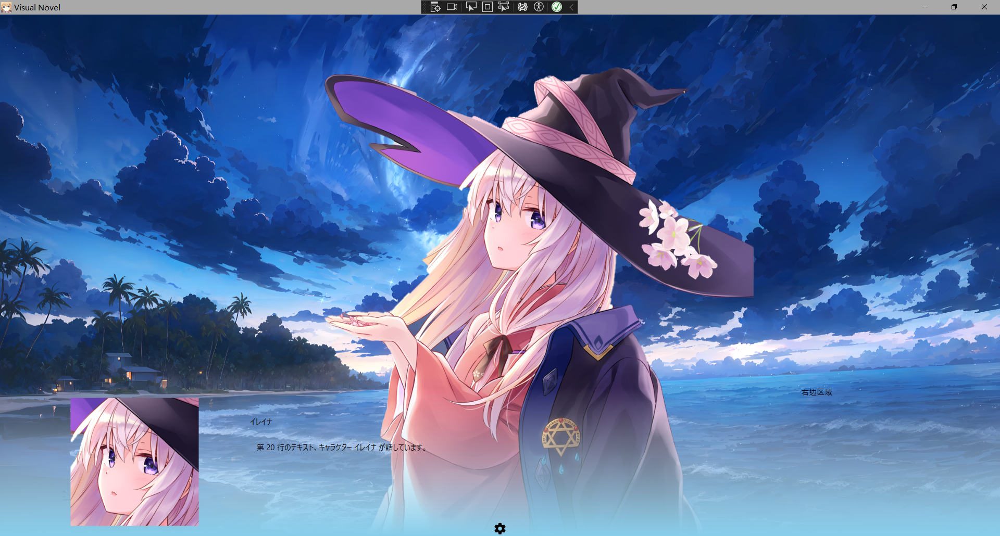

# visual-novel-game
## visual-novel-game

这是一个使用WPF, EF Core和PRISM MVVM框架开发的简单的视觉小说游戏。


## 预览






## 技术栈

- WPF
- EF Core
- Prism.Unity


## 安装和设置

1. clone本仓库

    ``` bash
    git clone https://github.com/HoshiZ/visual-novel-game.git
    ```
2. 安装必要的Nuget包
    ``` bash
    dotnet restore
    ```
3. 进入项目的`VisualNovelGameDB`文件夹，执行此命令，使实体属性迁移到数据库中，**数据库默认使用Oracle，端口号为1522。如果你想修改到其他数据库或端口号，请修改`xxx`文件的`xxx`的值为对应数据库的连接字符串**。
    ``` bash
    cd VisualNovelGameDB
    dotnet ef migrations add InitialMigration
    dotnet ef database update
    ```
4. 回到项目的根目录，进入项目的Bogus文件夹运行`Program.cs`文件，以创建测试数据到数据库中。
    ``` bash
    cd ../
    dotnet run
    ```
5. 运行`visual-novel-game`
     ``` bash
     cd VisualNovelGame
     dotnet run
     ```   
